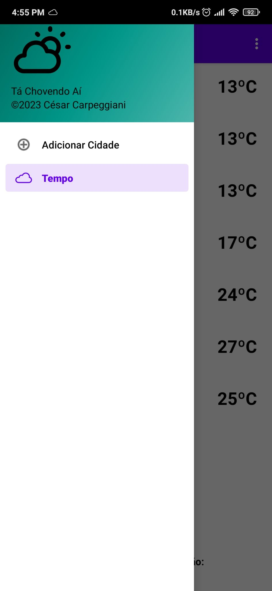
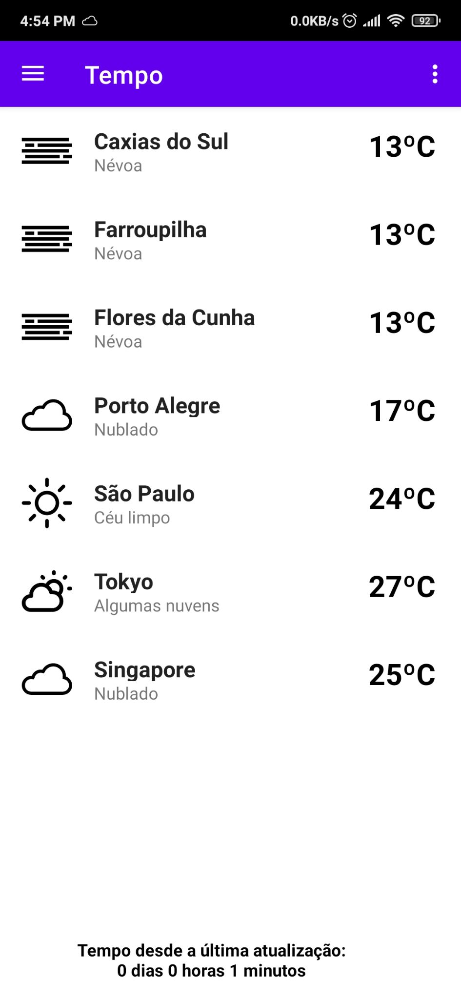
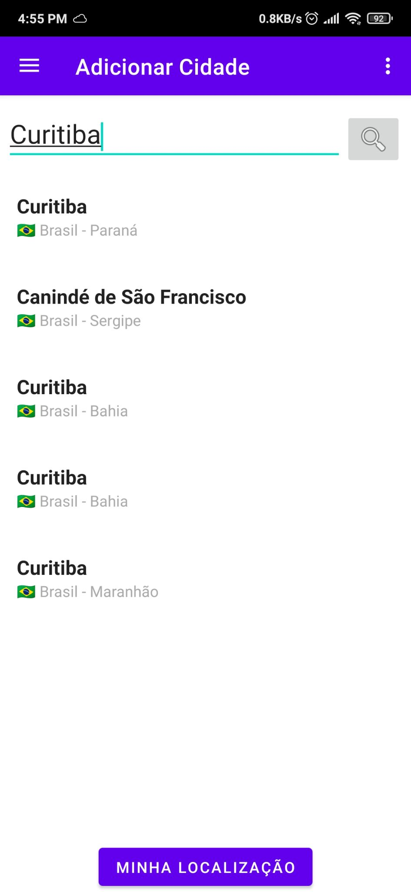

# Tá Chovendo Aí?

This is a simple Android weather app that fetches and displays weather information using the OpenWeatherMap API.

  

## Features

- Display current weather conditions for a list of specified locations
- Get weather for current GPS location
- Light and dark modes

## Requirements

- Android Studio
- OpenWeatherMap API key

## Installation

1. Clone the repository:
   ```bash
   git clone https://github.com/ItsMrDawn/ta-chovendo-ai/
   ```


2. Open the project in Android Studio.

3. Obtain an API key from OpenWeatherMap.

4. Add your API key to the ```APIClient.java``` file inside the 'rest' folder:

```java
public static final String API_KEY = "YOUR_KEY_HERE";
```
5. Build and run the app on an emulator or physical device of choice.

## Usage

1. Open the burger menu on the left side of the top bar, and enter the name of the city you want to check the weather for.

2. Tap the name of the city from the results to fetch and display the weather information.

## License
This project is licensed under the GPLv3 License. See the LICENSE file for details.

## Acknowledgements
[Erik Flowers](https://github.com/erikflowers/weather-icons) for the really nice SVG weather icons.

[OpenWeatherMap](https://openweathermap.org/) for providing the weather data API.
